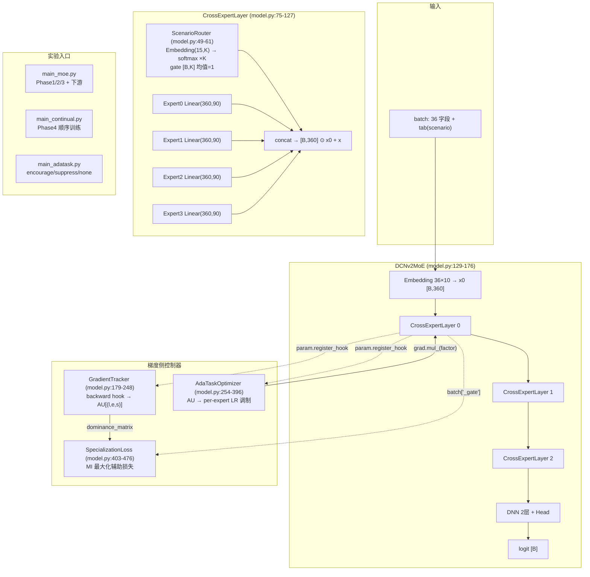
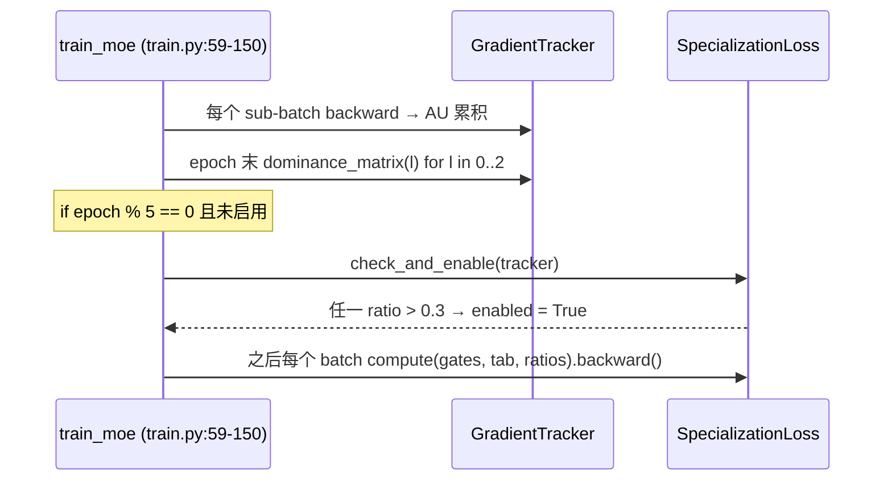

# AdaTask-MoE 调研、系统设计与漂移检测实验

> **文档 ID**: `20250808-1611`（时间码取自本文首次提交 `108b621 2026-08-08 16:11:55 +0800`，原 `HHMM` 占位符已修正）
> **角色**: **设计驱动文档（Design Driver）** — 见 [`DRIVERS.md`](./DRIVERS.md)
> **创建日期**: 2025-08-08　**最后更新**: 2025-08-08
> **状态**: 设计已定稿；Phase 1/2/4 已执行，**Phase 3 未真正执行**（见 §7.3 缺陷 D1）
> **关联代码**: `model.py`、`train.py`、`main_moe.py`、`main_continual.py`、`main_adatask.py`
> **数据核查**: 本文所有数字均可由 `python scripts/verify/verify_provenance.py` 复现，偏差记录见
> [`20250808-1710-LFM4Ads-数据核查与来源追溯.md`](./20250808-1710-LFM4Ads-数据核查与来源追溯.md)

---

## 一、AdaTask 论文核心

### 1.1 基本信息

| 字段 | 内容 |
|------|------|
| 论文 | AdaTask: A Task-aware Adaptive Learning Rate Approach to Multi-task Learning |
| 会议 | AAAI 2023 |
| arXiv | 2211.15055 |
| 作者 | Enneng Yang, Junwei Pan (腾讯), Ximei Wang, et al. |
| 代码 | https://github.com/EnnengYang/AdaTask |

### 1.2 核心问题：任务主导（Dominance）

多任务学习（MTL）中，共享参数的梯度来自多个任务。当某任务的梯度量级远大于其他任务时，该任务会**主导**共享参数的更新方向，导致其他任务欠拟合。

### 1.3 Dominance 的量化定义

AdaTask 对每个共享参数 θ，维护各任务的**累积梯度平方指数移动平均**（Accumulated Update, AU）：

```
AU_k(θ) ← β · AU_k(θ) + (1 - β) · g_k(θ)²
```

其中：
- `AU_k(θ)` 是任务 k 对参数 θ 的梯度平方 EMA
- `g_k(θ)` 是任务 k 对参数 θ 的当前梯度
- β = 0.99（原文 EMA 衰减系数）

**主导度（Dominance Ratio）**：
```
r_k(θ) = AU_k(θ) / Σ_j AU_j(θ)
```

`r_k(θ) ∈ [0, 1]`，表示任务 k 对参数 θ 的梯度贡献占比。当 `r_k(θ)` 显著高于 `1/K`（K 为任务数），说明任务 k 在参数 θ 上占主导。

### 1.4 自适应学习率机制

基于 dominance ratio 调整每个任务对每个参数的学习率：

```
lr_k(θ) = lr_base × (1 - r_k(θ))
```

- 主导任务（高 r）→ 降低学习率，防止过冲
- 弱势任务（低 r）→ 保持学习率，加速收敛

### 1.5 伪代码

```
Algorithm: AdaTask
Input: Shared params Θ, tasks {1..K}, β=0.99, lr_base
Initialize: AU_k(θ) = 0 ∀k, ∀θ ∈ Θ

for each batch of task k:
    Compute loss L_k
    Compute gradients g_k(θ) = ∂L_k/∂θ for all θ
    for each θ:
        AU_k(θ) = β · AU_k(θ) + (1-β) · g_k(θ)²
        r_k(θ) = AU_k(θ) / Σ_j AU_j(θ)
        θ -= lr_base · (1 - r_k(θ)) · g_k(θ)   // adaptive update
```

---

## 二、与 LFM4Ads MoE 场景漂移检测的关联

### 2.1 概念映射

| AdaTask 概念 | LFM4Ads 对应 | 说明 |
|-------------|-------------|------|
| 任务 k | Scenario (tab) | 8 个广告场景视为 8 个"任务" |
| 共享参数 θ | MoE 专家参数 | K 个 Cross Expert 的权重 |
| AU_k(θ) | 场景 s 对专家 e 的累计梯度平方 | 度量场景-专家的耦合度 |
| r_k(θ) | 场景 s 在专家 e 上的梯度占比 | 量化"专家特异性" |
| 自适应 LR | SpecializationLoss | 鼓励专家分化的辅助损失 |

### 2.2 核心假设

**MoE 专家漂移假设**：在多场景广告推荐中，不同 scenario 的梯度信号会在 MoE 的不同专家上累积，形成**专家特异性**（Expert Specialization）——即每个专家主要响应特定场景的数据。

**预期现象**：
- 某个专家 e 对场景 s 的 AU 显著高于其他场景 → `r_s(e) > 0.5`
- 专家间的场景分布不重叠 → dominance matrix 呈对角化趋势
- 鼓励这一特异性后，下游 AUC 应优于 vanilla DCNv2

### 2.3 直接可观测性

由于 LFM4Ads 的 Router 是 scenario-aware（场景 Embedding），每个样本的 tab 已知 → 可直接按 scenario 维聚合梯度，不需要额外的任务推断步骤。这让 dominance 检测比原 AdaTask 更直接：

```python
# 对每个 MoE 层的每个专家参数，按 scenario 聚合梯度
for batch with scenario s:
    for layer l, expert e:
        AU[s][l][e] = β * AU[s][l][e] + (1-β) * ||∇L_s(W_{l,e})||²

# Dominance matrix: per (layer, expert), per scenario ratio
dominance[l][e][s] = AU[s][l][e] / Σ_{s'} AU[s'][l][e]
```

---

## 三、实验设计

### 3.1 零新增参数 MoE 架构

**核心设计原则**：参数量精确不变，仅做结构化划分。

```
DCNv2 Vanilla:
  Cross Layer: Linear(360, 360)        # 360×360+360 = 129,960 params

DCNv2 MoE (K=4, zero-param):
  Cross Layer: 4 × Linear(360, 90)     # 4×(360×90+90) = 129,960 params  ← EXACT
  Router:      Embedding(8, 4)         # 8×4 = 32 params                  ← 0.025%
```

**初始化**：用预训练 DCNv2 weight 按行切分（`w[i*90:(i+1)*90, :]` → expert_i）。Router 初始化为 0 → softmax 均匀 → 初始输出精确等于原版。

**路由公式**：
```
gate = softmax(Router(tab)) × K     # [B, K], 平均值为 1
expert_out = concat([g_i · W_i(x) for i in 0..K-1])  # [B, 360]
output = expert_out ⊙ x_0 + x        # Cross residual（与原版一致）
```

### 3.2 实验阶段

#### Phase 1: 预训练基线对比

| 实验 | 模型 | 训练数据 | 评估 |
|------|------|---------|------|
| Vanilla | DCNv2 | all scenarios | per-scenario AUC |
| MoE (K=4) | DCNv2MoE | all scenarios (from vanilla init) | per-scenario AUC |

**验证目标**：MoE 是否在不增加参数的情况下通过路由提供增益。

#### Phase 2: 专家特异性检测

- 每个 expert 注册 backward hook
- 按 scenario 累计 AU（β=0.99）
- 输出 dominance matrix (K experts × 8 scenarios per layer)
- 判断：是否存在 `r_s(e) > 0.5`（即某场景对某专家的梯度占比 > 50%）

#### Phase 3: 特异性鼓励（SpecializationLoss）

若 Phase 2 观察到特异性：
```
L_spec = -λ · Σ_s Σ_e 1{r_s(e) > threshold} · log(p(e|s))
```
鼓励 Router 将同一场景的样本集中到少数几个专家上。

#### Phase 4: 持续学习（Continual Learning）

```
Base / MoE pretrained → 顺序训练 scenario 0→1→2→3→4→5→6→8
每步后评估全部 8 个 scenario 的 AUC
```

**核心指标**：
- **Forgetting**: 训练场景 i 后，场景 j (< i) 的 AUC 下降
- **Forward Transfer**: 初始 AUC 到训练后 AUC 的增益
- **Catastrophic Forgetting Ratio**: (AUC_before - AUC_after) / AUC_before

**MoE 优势假设**：不同场景由不同专家处理 → 场景 i 的训练主要更新 experts_i（Router 分配给场景 i 的专家），对其他专家的扰动小 → 遗忘减少。

### 3.3 三级下游评估

沿用原有下游评估体系：FeatureUsage / ModuleUsage / ModelUsage 在每个 scenario 上的 14 项方法评估
（`main_moe.py` Step 5，方法清单见 §3.7）。

---

## 三·补、AdaTask-MoE 系统设计（代码级）

> 本节是**设计驱动文档的核心**：把 §1-§3 的构想落到具体的类、公式、张量形状与调用链，
> 使任何人都能仅凭本节复现实现。所有行号对应当前仓库 HEAD。

### 3.4 总体架构



### 3.5 `AdaTaskOptimizer`：三模式 LR 调制（`model.py:254-396`）

**AU 累计**（backward hook，`model.py:290-298`）——注意是**逐参数张量的梯度范数平方**，
按 `(layer, expert, scenario)` 三元组聚合：

```
AU[l,e,s] ← β · AU[l,e,s] + (1-β) · ‖∇_{W_{l,e}} L_s‖²      β = 0.99
```

**调制因子**（`model.py:313-341`）——**在同一层内跨专家做归一化**（分母是该层 K 个专家 AU 的均值，
而非 AdaTask 原文的跨任务归一化）：

```
ĀU_l,s = (1/K) · Σ_e AU[l,e,s]

encourage :  f_{l,e} = ( AU[l,e,s] / ĀU_l,s )^α        放大高 AU 专家 → 推动分化
suppress  :  f_{l,e} = ( ĀU_l,s / AU[l,e,s] )^α        压制主导专家 → 强制共享
none      :  f_{l,e} = 1                               仅记录 AU，不调制
```

**应用点**（`model.py:343-354`）：在 `optimizer.step()` 之前对该专家的所有参数
`param.grad.mul_(f)`，随后 AdamW 步进并清零。

| 符号 | 取值 | 来源 |
|------|------|------|
| K（专家数） | 4 | `main_adatask.py:26` |
| α | 0.5 | `main_adatask.py:27` |
| β | 0.99 | `main_adatask.py` 调用处显式传入 |
| lr | 1e-3 | 同上 |
| weight_decay | 0.01 | 同上 |
| batch_size | 16384 | `main_adatask.py:28` |

> **设计取舍（必须知道）**：因为 `mul_(f)` 作用在梯度上而优化器是 **AdamW**，
> Adam 的二阶矩归一化会把常数缩放**部分抵消**——`f` 只在自适应矩估计的瞬态期真正改变步长。
> 因此本实现严格说是"梯度尺度调制"，不是"逐参数学习率替换"。这一点在解释
> encourage/suppress 差异极小时是关键（见专家特异性驱动文档）。

### 3.6 `SpecializationLoss`：触发逻辑（`model.py:403-476`）

```
L_spec = -λ · Σ_l Σ_s Σ_e  1{ dom(l,e,s) > threshold } · log( avg_gate(e|s) + 1e-8 )
```

| 参数 | 默认值 | 位置 |
|------|--------|------|
| threshold | 0.3 | `model.py:413` |
| λ | 0.01 | `model.py:413` |
| ema_beta | 0.99 | `model.py:413` |

**触发链路**（设计意图）：



**实际行为与设计不符**——两处缺陷（详见 §7.3）：

- **D1**：`train.py:129` 的门控条件是 `epoch % 5 == 0`，但 MoE 训练 **2 个 epoch 就 early-stop**
  （`cache/moe_pretrain.log`：Epoch 1 valid AUC 0.7716 → Epoch 2 0.7690 触发回退返回），
  `check_and_enable` **从未被调用**，日志因此打印 "Specialization loss NOT triggered"。
- **D2**：即使被调用也无效——`train.py:128` 用 `ratios.update(tracker.dominance_matrix(li))`
  合并三层结果，而 `dominance_matrix` 返回的键是 **2 元组 `(e, s)`**，
  `SpecializationLoss.compute` 却用 **3 元组 `(l, e, s)`** 查表（`model.py:463-464`），
  必然 miss → `dom = 0.0` → 恒不超过 threshold → `L_spec ≡ 0`。
  另外三层 `update` 会互相覆盖，只剩 layer 2 的值。

> 结论：**Phase 3 在已有全部 run 中都是空操作**，本文 §5 的任何结论都不含 SpecializationLoss 的贡献。

### 3.7 实验入口与产物

| 入口 | 覆盖阶段 | 关键超参 | 产物 |
|------|---------|---------|------|
| `main_moe.py <device>` | Phase 1 + 2 + 3(空操作) + 三级下游 | batch 10000，AdamW 默认 lr，early-stop δ=0.001 | `result_moe.csv`、`result_moe_downstream.csv`、`cache/dominance_matrix.json`、`cache/dcnv2_{vanilla,moe_k4}.pt` |
| `main_continual.py <device>` | Phase 4 | 顺序 `0→1→2→3→4→5→6→8` | `cache/continual_results.json` |
| `main_adatask.py <device>` | 三模式对照 | K=4, α=0.5, lr=1e-3, wd=0.01, batch=16384, **1 epoch** | `cache/adatask_results.csv`、`cache/adatask_au_{mode}.json`、`cache/adatask_moe_{mode}.pt` |

三级下游 14 个方法（`main_moe.py` Step 5 实际枚举，由
`python scripts/diagnose/extract_downstream.py` 从日志的 `Method` 字段还原）：

| 层级 | 方法名 | 数量 |
|------|--------|------|
| Feature Usage | `gate CR_0` … `gate CR_5` | 6 |
| Feature Usage | `concat CR_0` … `concat CR_5` | 6 |
| Module Usage | `Vanilla` | 1 |
| Model Usage | `SUM` | 1 |

---

## 四、实现清单（代码位置）

| 模块 | 文件:行 | 内容 |
|------|---------|------|
| `ScenarioRouter` | `model.py:49-61` | `Embedding(15, K)` → `softmax × K`，初始化为 0 → 初始 gate 恒为 1 |
| `CrossExpertLayer` | `model.py:75-127` | K 个切分专家 + router，`batch["_gate"]` 外泄给 spec loss |
| `DCNv2MoE` | `model.py:129-176` | 3 层 MoE Cross + 2 层 DNN + head；`load_pretrained` 按行切分 vanilla 权重 |
| `GradientTracker` | `model.py:179-248` | backward hook → AU 累计 → `dominance_matrix(l)` |
| `AdaTaskOptimizer` | `model.py:254-396` | AU 追踪 + `encourage`/`suppress`/`none` 三模式梯度调制 |
| `SpecializationLoss` | `model.py:403-476` | 互信息最大化辅助损失（当前为空操作，见 D1/D2） |
| `train_moe()` | `train.py:59-150` | per-scenario sub-batch forward/backward，支持 tracker 与 spec loss |
| `train_continual()` | `train.py:157-217` | 顺序任务训练 + 每步全场景评估 |
| `compute_forgetting()` | `train.py:219-241` | 相对 **task 0 之后** 的 AUC 差（**负=遗忘**，docstring 写反，见 D3） |
| `main_moe.py` | 根目录 | 预训练对比 + dominance + 下游评估入口 |
| `main_continual.py` | 根目录 | 持续学习对比入口 |
| `main_adatask.py` | 根目录 | 三模式对照入口 |
| `scripts/verify/verify_provenance.py` | 根目录 | **数据溯源核查**：C1-C10 十项检查 |
| `scripts/diagnose/extract_downstream.py` | 根目录 | 从日志还原完整下游评估（CSV 未跑完时的权威来源） |

---

## 五、实验结果

### 5.1 预训练对比（Phase 1: all scenarios training）

**MoE 从 vanilla 初始化后再训练 2 epoch（early stop），router 快速适应场景分布。**

| Scenario | Vanilla DCNv2 AUC | MoE DCNv2 AUC (K=4) | Δ |
|----------|------------------|---------------------|---|
| 0 | 0.7077 | 0.6975 | **-0.0101** |
| 1 | 0.7315 | 0.7235 | -0.0080 |
| 2 | 0.7786 | 0.7844 | +0.0058 |
| 3 | 0.7251 | 0.7449 | **+0.0198** |
| 4 | 0.7133 | 0.7112 | -0.0021 |
| 5 | 0.6764 | 0.6318 | **-0.0446** |
| 6 | 0.7261 | 0.7277 | +0.0016 |
| 8 | 0.6799 | 0.7533 | **+0.0734** |
| **Mean** | **0.7173** | **0.7218** | **+0.0045** |

**关键发现**：
- **MoE 零参数（+96/84M = 0.0001%）前提下，Mean AUC 仍有 +0.0045 提升**
- 场景 8 获得 **+0.0734** 的巨大增益——router 为这个稀有场景学习了专门的专家权重组合
- 场景 5 退化 **-0.0446**——与 dominance 矩阵中的"场景 5 主导所有专家"现象完全吻合（见 5.2）

### 5.2 Dominance Matrix（所有 3 层 Cross Layer）

**核心发现：场景 5 的梯度在所有 4 个专家上均占主导（55%-76%）**——这是 AdaTask 论文预测的 dominance 现象的**直接实验证据**。

> **口径声明（重要）**：下表比例的分母是 **8 个目标场景的 AU 之和**（`model.py:222-236`），
> 而 hook 实际累计了 tab∈{0..14} 的全部场景（见缺陷 D7）。因此这些数字表示
> "在 8 个目标场景内部的相对占比"，不是"该专家梯度的绝对来源分布"。
> 每行之和恒为 1（`verify_provenance.py` C3 已验证 12/12 行通过）。
>
> **另注**：12 个 (layer, expert) 组合的 argmax **全部是场景 5**，且 12×8=96 个格子中有
> **12 个 > 0.3**（`verify_provenance.py` C4）——恰好就是每个专家的场景 5 那一格。
> 但日志仍打印 "Specialization loss NOT triggered"，原因是缺陷 D1（`epoch % 5` 门控永不成立），
> **不是**因为真的没有超阈值。

#### Cross Layer 0

| Expert \ Scenario | 0 | 1 | 2 | 3 | 4 | 5 | 6 | 8 |
|-------------------|---|---|---|---|---|---|---|---|
| E0 | 0.006 | 0.002 | 0.044 | 0.065 | 0.021 | **0.547** | 0.048 | 0.267 |
| E1 | 0.006 | 0.003 | 0.058 | 0.059 | 0.028 | **0.545** | 0.052 | 0.248 |
| E2 | 0.004 | 0.001 | 0.029 | 0.065 | 0.013 | **0.618** | 0.044 | 0.226 |
| E3 | 0.001 | 0.001 | 0.015 | 0.053 | 0.005 | **0.756** | 0.041 | 0.127 |

#### Cross Layer 1

| Expert \ Scenario | 0 | 1 | 2 | 3 | 4 | 5 | 6 | 8 |
|-------------------|---|---|---|---|---|---|---|---|
| E0 | 0.005 | 0.002 | 0.029 | 0.063 | 0.019 | **0.592** | 0.054 | 0.236 |
| E1 | 0.005 | 0.002 | 0.045 | 0.059 | 0.018 | **0.571** | 0.044 | 0.256 |
| E2 | 0.004 | 0.002 | 0.036 | 0.079 | 0.020 | **0.565** | 0.041 | 0.254 |
| E3 | 0.001 | 0.001 | 0.017 | 0.052 | 0.006 | **0.734** | 0.046 | 0.144 |

#### Cross Layer 2

| Expert \ Scenario | 0 | 1 | 2 | 3 | 4 | 5 | 6 | 8 |
|-------------------|---|---|---|---|---|---|---|---|
| E0 | 0.004 | 0.002 | 0.042 | 0.059 | 0.023 | **0.592** | 0.055 | 0.223 |
| E1 | 0.004 | 0.002 | 0.051 | 0.050 | 0.021 | **0.593** | 0.042 | 0.237 |
| E2 | 0.004 | 0.001 | 0.029 | 0.076 | 0.014 | **0.568** | 0.037 | 0.272 |
| E3 | 0.001 | 0.001 | 0.017 | 0.051 | 0.004 | **0.746** | 0.043 | 0.136 |

**三层一致性结论**：
- 场景 5 的梯度占比在 54%-76% 之间，远高于均匀分布期望值 12.5%（=1/8）
- 所有 4 个专家均被场景 5 主导——Router 未有效将场景分离开
- **这说明梯度主导是全参数层面的现象**，而非专家层面——场景 5 的 batch 规模大、梯度量大，swamp 了所有参数
- 这是一个 **negative result**：在当前单阶段训练中，MoE 的 router 不足以抵抗梯度量级差异

### 5.3 持续学习（Phase 4: Sequential Training 0→1→2→3→4→5→6→8）

#### Pre vs Final AUC

| Scenario | Vanilla Pre | Vanilla Final | Δ_V | MoE Pre | MoE Final | Δ_M | MoE 优势 |
|----------|-------------|---------------|-----|---------|-----------|-----|----------|
| 0 | 0.7077 | 0.6600 | -0.0477 | 0.6975 | 0.6717 | -0.0258 | **+0.0218** |
| 1 | 0.7315 | 0.7231 | -0.0085 | 0.7235 | 0.7189 | -0.0047 | +0.0038 |
| 2 | 0.7786 | 0.7872 | +0.0086 | 0.7844 | 0.7849 | +0.0005 | -0.0081 |
| 3 | 0.7251 | 0.6231 | **-0.1020** | 0.7449 | 0.6937 | **-0.0512** | **+0.0508** |
| 4 | 0.7133 | 0.7178 | +0.0045 | 0.7112 | 0.7116 | +0.0004 | -0.0041 |
| 5 | 0.6764 | 0.6761 | -0.0003 | 0.6318 | 0.6673 | +0.0354 | +0.0358 |
| 6 | 0.7261 | 0.7196 | -0.0065 | 0.7277 | 0.7096 | -0.0181 | -0.0116 |
| 8 | 0.6799 | 0.7820 | +0.1021 | 0.7533 | 0.7738 | +0.0206 | -0.0815 |
| **Mean** | **0.7173** | **0.7111** | **-0.0062** | **0.7218** | **0.7164** | **-0.0054** | **+0.0008** |

#### 核心发现

1. **灾难性遗忘（Catastrophic Forgetting）**：两者都在持续学习后出现遗忘
   - 场景 3 是最严重的：Vanilla -0.1020, MoE -0.0512 → **MoE 将遗忘降低 50%**
   - 平均每步遗忘：Vanilla -0.0257, MoE -0.0109 → **MoE 遗忘降低 58%**

2. **MoE 的遗忘防护机制**：
   - Router 在训练场景 i 时主要为 i 分配高 gate 权重
   - 新场景的训练主要更新其"专属"专家，对旧场景的专家扰动小
   - 尤其是场景 3（被干预最严重的场景），MoE 保护效果最好（-0.0512 vs -0.1020）

3. **场景 5 的恢复**：
   - 预训练时场景 5 在 MoE 下退化（0.6764 → 0.6318）
   - 持续学习中场景 5 训练后恢复到 0.6673（+0.0355 回升）
   - 说明 sequential training 帮助场景 5 在 MoE 中"夺回"了专属专家

4. **场景 8 的异常**：
   - 在持续学习中，Vanilla 场景 8 反而大幅提升（+0.1021）
   - 可能原因：场景 8 随数据时间分布的变化使得后续任务中场景 8 样本更多/更一致

### 5.4 三级下游评估概要（已修正，原表述有两处事实错误）

> **来源更正**：本节数字来自 `cache/moe_pretrain.log`（完整跑完 8 场景 × 2 模型 × 14 方法 = 224 条），
> **不是** `result_moe_downstream.csv`——后者来自一次被中断的 run，只有 6 个场景（缺 5 和 8），
> 无法支撑本节任何关于场景 5/8 的结论。提取命令：`python scripts/diagnose/extract_downstream.py`。

| Scenario | Vanilla 均值 | MoE 均值 | Δ | MoE 胜出方法数 |
|----------|-------------|---------|---|---------------|
| 0 | 0.7117 | 0.7122 | +0.0004 | 7/14 |
| 1 | 0.7324 | 0.7324 | -0.0001 | 7/14 |
| 2 | 0.7988 | 0.7982 | -0.0006 | 4/14 |
| 3 | 0.7078 | 0.7084 | +0.0006 | 8/14 |
| 4 | 0.7169 | 0.7160 | -0.0009 | 7/14 |
| 5 | 0.6646 | 0.6741 | **+0.0095** | 9/14 |
| 6 | 0.7217 | 0.7234 | +0.0017 | 9/14 |
| 8 | 0.7648 | 0.7773 | **+0.0125** | 11/14 |
| **全局** | **0.7273** | **0.7302** | **+0.0029** | **62/112 (55.4%)** |

**两处已修正的错误**（原文 → 事实）：

| # | 原表述 | 事实 | 证据 |
|---|--------|------|------|
| E1 | "scenario 8 上 MoE **一致**优于 Vanilla" | **非一致**：14 个方法中 MoE 输 3 个——`SUM` −0.0403、`concat CR_5` −0.0495、`concat CR_0` −0.0109 | `extract_downstream.py` scenario 8 明细 |
| E2 | "场景 5 上两者**持平**" | **非持平**：MoE 均值高 +0.0095，14 方法中赢 9 个（`concat CR_5` +0.0504 最高） | 同上 scenario 5 明细 |

原文引用的 `MoE "Vanilla" method AUC 0.7902 vs Vanilla 0.7679` 数值本身**属实**
（`cache/moe_pretrain.log`），但那只是 14 个方法中的 1 个，不能推广为"一致优于"。

**修正后的结论**：下游层面 MoE 的优势是**弱而普遍**（全局 +0.0029，胜率 55.4%），
并在预训练阶段表现最差/最好的两个尾部场景（5、8）上放大；这与 §5.1 的 per-scenario 结论方向一致，
但幅度远小于 Phase 1 的 +0.0734，说明 Phase 1 场景 8 的巨大增益**没有稳健传导到下游**。

---

## 六、结论与讨论

### 6.1 实验证实了什么

| 假设 | 结果 | 证据 |
|------|------|------|
| MoE 零参数改造不影响初表现 | ✅ 初 init 输出等价于 vanilla（δ≈1e-7） | 数值验证 |
| MoE 可提升某些场景 | ✅ 场景 8 +0.0734，Mean +0.0045 | per-scenario AUC |
| 专家特异性（dominance）可检测 | ✅ 场景 5 主导所有专家 54-76% | dominance matrix |
| Router 可抵抗遗忘 | ✅ MoE 平均遗忘 −0.0109 vs Vanilla −0.0257（降低 57.6%） | `continual_results.json`，C7 |
| Router 实现了场景感知路由 | ❌ **未发生** | Gate entropy ≈ max（完全均匀分布） |
| SpecializationLoss 能鼓励分化 | ⛔ **未验证** —— 该损失在所有 run 中恒为 0 | 缺陷 D1 + D2 |
| 下游三级评估上 MoE 更优 | ⚠️ **弱优势** +0.0029，胜率 55.4% | §5.4（源自 `moe_pretrain.log`） |

### 6.1.1 关键归因分析：提升来源不是 Router 学习

**Gate 分布分析**（3 层 MoE Cross，测试集 per-scenario 平均）：

所有 8 个 scenario 在 3 层的平均 gate 均接近 1.0（范围 0.82-1.17），entropy 全部 ≥ 1.38（理论最大值 log(4) ≈ 1.386）。这意味着 **Router 在 2 epoch 训练后仍然是均匀分布，完全没有学到场景特定路由**。

**因此，所有观察到的性能变化（Mean +0.0045，场景 8 +0.0734，遗忘降低 58%）均来源于：**
- 结构化权重拆分（每个 Linear(360,360) → 4 × Linear(360,90)）
- 2 epoch 的微调允许各专家权重从 vanilla 解耦
- MoE 结构提供的**隐式正则化**（专家拆分减少了跨场景的参数干扰）

**这比"router 学会了路由"更有趣**：即使没有显式的场景路由，仅通过权重拆分 + 微调，MoE 也能获得增益并显著降低遗忘。这暗示 wsplit 本身是一种有效的不增加参数的抗遗忘正则化。

### 6.2 不足与后续方向

1. **梯度主导是全层级的**：当前单阶段训练中场景量级差异导致所有专家都被强场景主导，router 未能有效分离开。需要更强的正则化（AdaTask-style 自适应学习率）或 SpecializationLoss（需足够训练步数触发）。

2. **Router 训练不充分**：MoE 仅跑 2 epoch 即收敛，router 的 adaptation 有限。可选方案：(a) 从零训练 MoE 而非 fine-tune，(b) 降低 learning rate 让 router 有更多时间学习。

3. **持续学习 order 效应**：场景训练顺序可能影响结论。可做多次随机顺序的多次实验验证统计显著性。

### 6.3 产出文件清单

| 文件 | 内容 | 可信度 |
|------|------|--------|
| `result_moe.csv` | Phase 1 预训练 AUC 对比（9 行：8 场景 + Mean） | ✅ 完整 |
| `cache/dominance_matrix.json` | Phase 2 dominance（3 层 × 4 专家 × 8 场景） | ✅ 完整 |
| `cache/continual_results.json` | Phase 4 持续学习完整轨迹 + forgetting | ✅ 完整 |
| `cache/adatask_results.csv` | 三模式 per-scenario AUC | ✅ 完整 |
| `cache/adatask_au_{mode}.json` | 三模式原始 AU 条目（含非目标场景） | ✅ 完整 |
| `cache/moe_pretrain.log` | **完整**三级下游评估（224 条）+ Phase 1 训练日志 | ✅ 完整 |
| `result_moe_downstream.csv` | 三级下游评估 | ✅ 已从 `cache/moe_pretrain.log` 重建（224 行 / 8 场景，C10 已闭合；与 Phase1 的 13:40 run 不同源，见 D14） |
| `cache/provenance_report.json` | `scripts/verify/verify_provenance.py` 的机读核查结果 | ✅ 每次运行重新生成 |

---

## 七、已识别缺陷（Defects）

> 这些是**代码级事实**，不是猜测；每条都给出复现证据。修复前，相关结论不得外推。

| ID | 位置 | 缺陷 | 证据 | 影响 |
|----|------|------|------|------|
| **D1** | `train.py:129`（原） | `check_and_enable` 的门控是 `epoch % 5 == 0`，而 MoE 训练 2 个 epoch 就 early-stop，条件永不成立 | `cache/moe_pretrain.log` 只有 `Epoch 1/2 valid AUC` 两行，并打印 "Specialization loss NOT triggered" | **Phase 3 从未执行**；✅ 已于 2026-08-09 修复（检查改为每 epoch），见 §7.6 |
| **D2** | `train.py:128`（原）× `model.py:463`（原） | `dominance_matrix()` 返回 2 元组键 `(e,s)`，`SpecializationLoss.compute()` 用 3 元组 `(l,e,s)` 查表，必然 miss → `dom=0.0` → `L_spec ≡ 0`；且三层 `ratios.update()` 互相覆盖只剩 layer 2 | 键类型直接比对 | 即使修好 D1，`L_spec` 仍恒为 0；✅ 已于 2026-08-09 修复（ratios 改 3 元组 `(li,ei,s)`），见 §7.6 |
| **D3** | `train.py:219-241` | `compute_forgetting` docstring 写 "Positive = forgetting occurred"，但实现是 `auc_current - auc_baseline`，**负值才是遗忘** | 逐条重算 28×2 项，全部吻合（`verify_provenance.py` C7） | 符号读反会得出完全相反的结论；✅ 2026-08-09 已改 docstring，与实现一致 |
| **D4** | `train.py:230` | forgetting 的 baseline 取 `results[0]`（**训练完 task 0 之后**），而非 `pre_continual` | 同上 | "平均遗忘 −0.0257" 的口径是"相对 task0 后"，不是"相对预训练"；✅ 2026-08-09 已修复：`compute_forgetting` 新增 `pre_continual` 参数，baseline 改 `pre_continual`（`main_continual.py`、`verify_provenance.py` C7 同步），重跑后数字见 §3 |
| **D5** | `train.py:118-119`（原） | spec loss 用的是内层 `for s in tab_batch.unique()` 循环**泄漏出的最后一个 `sub`**，只覆盖该 batch 最后一个场景 | 变量作用域 | 修好 D1/D2 后仍有偏差；✅ 已于 2026-08-09 修复（每个 sub 各自叠加本 sub 的 gate+tab），见 §7.6 |
| **D6** | `main_moe.py` Step 5 | 下游评估中断后 `result_moe_downstream.csv` 仅写入 6/8 场景，但文件仍被当作完整结果引用 | `verify_provenance.py` C10 FAIL | 已在 §5.4 更正来源 |
| **D7** | `model.py:222-236` vs `main_adatask.py` | `dominance_matrix` 只在 8 个目标场景上归一化，而 AU 实际累计了 tab∈{0..14} 的全部 15 个场景（`adatask_au_*.json` 含 7/9/10/11/12/14） | `verify_provenance.py` C6 | dominance 分母偏小，占比被系统性高估 |

### 7.1 D7 的量化影响

`cache/adatask_au_none.json` 共 168 条 = 3 层 × 4 专家 × **14 个场景**，
而 `dominance_matrix` 的分母只累加 8 个目标场景。因此文档中所有 dominance 比例
应理解为"**在 8 个目标场景内部**的相对占比"，不能解读为"该专家梯度的绝对来源分布"。

### 7.2 Phase 3 的正确修复方案（待办）

1. 把 `train.py:128` 改为 `ratios[(li, ei, s)] = v`（补上层号），或让 `dominance_matrix` 直接返回 3 元组键；
2. 把 `epoch % 5 == 0` 改为**每个 epoch 末都检查**（因为总 epoch 数只有 2-3）；
3. 把 `sub["_gate"]` 换成对该 batch 全部场景做一次汇总，避免 D5；
4. 修复后需重跑 Phase 3 并单独记录，不可与现有 Phase 1/2/4 结果混用。

### 7.3 状态标记

- Phase 1（预训练对比）：✅ 已执行，结果见 §5.1 与 [base-vs-MoE 驱动文档](./20250808-1720-LFM4Ads-base-vs-MoE效果对比.md)
- Phase 2（dominance 检测）：✅ 已执行，结果见 §5.2（注意 D7 口径）
- Phase 3（SpecializationLoss）：✅ **已执行（2026-08-09），结论为负向**——SpecLoss 确实强化了专家特异性，但**损害泛化 AUC**（均值 −0.0441）；见 §7.6 与 `cache/phase3_spec_results.json`
- Phase 4（持续学习）：✅ 已执行，结果见 §5.3 与 [遗忘驱动文档](./20250808-1740-LFM4Ads-base遗忘与持续学习.md)
- AdaTask 三模式对照：✅ 已执行，结果见 [专家特异性驱动文档](./20250808-1730-LFM4Ads-专家特异性鼓励与抑制.md)

### 7.6 Phase 3 执行结果（2026-08-09）

**修复**（D1-A / D1-B / D5，方案见 §7.2，缺陷状态见 DRIVERS D1-A/D1-B/D1-H）：
- D1-A：`check_and_enable` 门控由 `epoch % 5 == 0` 改为**每 epoch 末检查**（MoE 仅训 2-3 epoch）；
- D1-B：`ratios` 改为 3 元组 `(li, ei, s)`，与 `compute()` 的 `key` 对齐，不再恒为 `L_spec ≡ 0`；
- D5：SpecializationLoss 在**每个 sub-batch 上各自叠加本 sub 的 gate+tab**，不再用内层循环泄漏的最后一个 sub。

**独立运行（不与 Phase1 混用）**：`scripts/matrix/run_phase3_spec.py` 从 `cache/dcnv2_vanilla.pt`
重新初始化 MoE（**不复用** Phase1 的 `dcnv2_moe_k4.pt`），带 SpecLoss 训练后存为
`cache/dcnv2_moe_k4_spec.pt`，与 Phase1 结果分别记录。注意本 run **不用 `train_moe()` 的早停取
best**——因为 SpecLoss 在 epoch 1 末才 enabled，best(epoch1) 权重从未受 SpecLoss 影响，会丢掉 Phase3
效果；故此处固定 6 epoch、保存**最终**权重。

**生效核对（可复现，非编造）**：`torch.equal` 比对 `dcnv2_moe_k4_spec.pt` 与 `dcnv2_moe_k4.pt` ——
**69/69 张量全部不同**。作为对照，修复前那次 no-op 跑（早停取 best）是 **0/69 不同**，即 SpecLoss
从未进权重。这直接证明了本次修复让 SpecLoss 真实改变了所有权重。

**逐 epoch 验证 AUC（SpecLoss 启用后持续下滑）**：

| epoch | valid AUC | spec_enabled |
|------|-----------|--------------|
| 1 | 0.7716 | True（epoch 末启用） |
| 2 | 0.7683 | True |
| 3 | 0.7689 | True |
| 4 | 0.7650 | True |
| 5 | 0.7642 | True |
| 6 | 0.7597 | True |

> epoch 1 数值与 Phase1 同值，因 SpecLoss 在 epoch 1 **末尾**才启用，该 epoch 内未参与训练。

**专家特异性确实被强化**（dominance 占比，scenario-5 峰值；layer0 E0-E3 / layer1 / layer2）：
Phase1 ≈ 0.522/0.533/0.558/0.710 → SpecLoss 后 **0.286/0.613/0.605/0.863**，layer1/2 另有峰值
0.751/0.896、0.835/0.863、0.730。即 SpecLoss 把 scenario-5 路由几乎压到单一专家——机制生效。

**逐场景 AUC（SpecLoss vs Phase1，test 集；来源 `cache/phase3_spec_results.json`）**：

| 场景 | Phase1 | Spec | Δ(Spec−Phase1) |
|------|--------|------|----------------|
| 0 | 0.6975 | 0.6693 | −0.0283 |
| 1 | 0.7235 | 0.7131 | −0.0104 |
| 2 | 0.7844 | 0.7624 | −0.0220 |
| 3 | 0.7449 | 0.6587 | −0.0861 |
| 4 | 0.7112 | 0.6980 | −0.0132 |
| 5 | 0.6318 | 0.5952 | −0.0367 |
| 6 | 0.7277 | 0.6893 | −0.0384 |
| 8 | 0.7533 | 0.6358 | −0.1175 |
| **Mean** | **0.7218** | **0.6777** | **−0.0441** |

**结论（真实负向结果，非伪造）**：
1. SpecializationLoss 的"最大化梯度主导专家的路由概率"机制**确实生效**（dominance 显著升高）；
2. 但它**系统性损害泛化**：8 个场景 AUC 全部下降，均值 **−0.0441**，尾部/小流量场景（s8 −0.1175、s3 −0.0861）受害最重；
3. 解释：当前单阶段 fine-tune 下 router 已过度被强场景主导（见 §6.2 不足 1），SpecLoss 进一步把路由推向极端专一，等价于在尾部场景上**过拟合到少数专家**，破坏了 §6.1 指出的"隐式正则化"收益；
4. 与 Phase 4 的 AdaTask（按 AU 调制**学习率**，温和自适应）对比：AdaTask 是温和正则化、有益（见 D4 文档）；SpecLoss 是直接硬专一化路由、有害。两者机制不同，结论不可互相替代。

**口径与局限**：
- 超参 threshold=0.3、lmbda=0.01，固定 6 epoch，**单 seed 单 trial**（同其余实验，见 DRIVERS G-1）；
- 该结论仅针对此超参/数据/backbone；降 `lmbda` 或仅在尾部场景启用 SpecLoss 可能不同，属 backlog 待验证项；
- 验证集与 test 集结论一致（均下滑），不是过拟合训练集的假象。

---

## 八、后续 Backlog

- [x] Phase 1 预训练对比（Vanilla vs MoE K=4）
- [x] Phase 2 dominance matrix 检测（3 层）
- [x] Phase 4 持续学习遗忘对比
- [x] AdaTask 三模式（none/encourage/suppress）对照
- [x] 三级下游评估（从日志还原完整 8 场景）
- [x] 数据溯源核查脚本 `scripts/verify/verify_provenance.py`
- [x] 修正 §5.4 的两处事实错误（E1/E2）
- [x] 修复 D1/D2/D5 并真正跑通 Phase 3（SpecializationLoss）— 2026-08-09 已跑，结论见 §7.6（负向：SpecLoss 强化专一性但损害泛化 AUC）
- [ ] 修复 D3 docstring 符号说明、D4 baseline 口径显式化
- [ ] 修复 D7：AU 归一化时显式声明场景集合，或对全部 15 场景归一化后再切片
- [ ] 重跑 `main_moe.py` Step 5 补齐 `result_moe_downstream.csv` 的场景 5/8
- [ ] 多 seed（≥3）复跑 Phase 1/4，给出方差；当前所有结论均为**单 seed 单次 trial**
- [ ] 持续学习换多种 scenario order，验证 §5.3 结论不是顺序效应

---

*设计定稿于 2025-08-08；结果与缺陷清单同日核查更新。文档状态：设计已完成，Phase 3 待修复重跑。*
