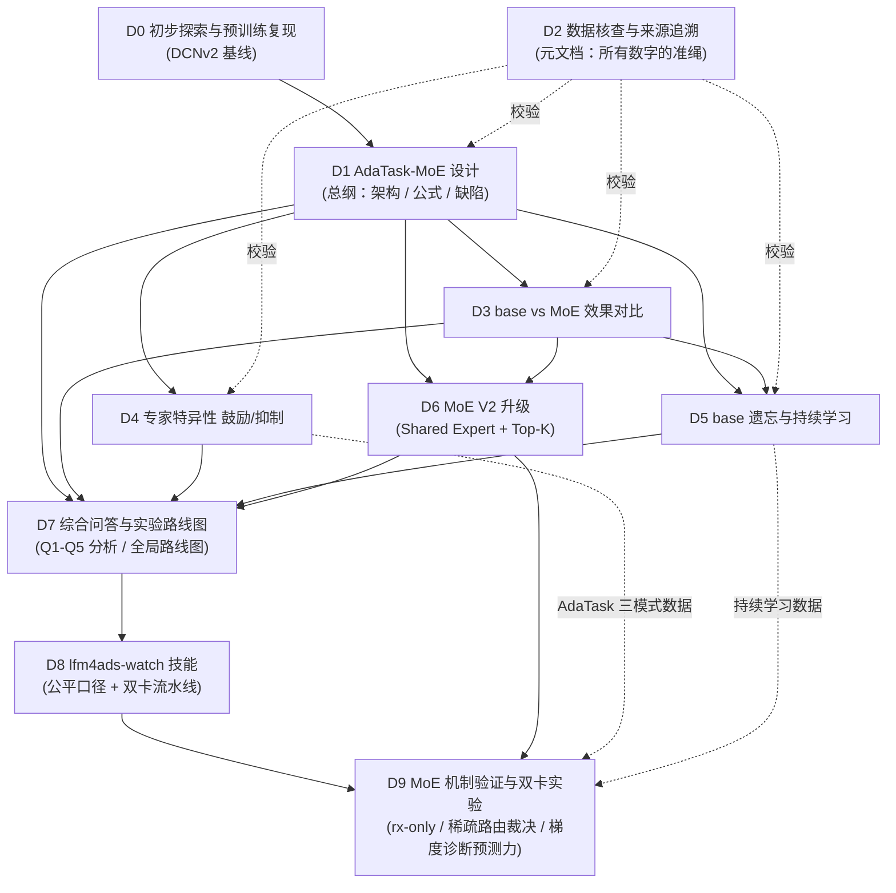

# DRIVERS.md — LFM4Ads 驱动文档注册表

> **这是文档驱动架构（Document-Driven Architecture）的入口。**
> 本仓库的每一项实验都由一份**驱动文档**统辖：文档先于/伴随实验存在，
> 声明目标、口径、数据来源与结论，实验代码只是驱动文档的执行体。
> 任何数字出现在文档里，必须能从 `来源文件 + 提取命令` 复现——否则视为无效。

- **命名规范**：`YYYYMMDD-HHMM-主题.md`（见 `AGENTS.md` §1）
- **核查命令**：`python scripts/verify/verify_provenance.py`（全量，含 444MB feather）
  / `--no-feather`（快速）
- **下游还原**：`python scripts/diagnose/reconstruct_downstream.py`（从 `cache/moe_pretrain.log` 重建 `result_moe_downstream.csv`）；`python scripts/diagnose/extract_downstream.py [logfile]`（仅打印摘要）
- **最后核查**：2025-08-08（本次会话从 `moe_pretrain.log` 重建下游 CSV，C10 已闭合），`cache/provenance_report.json`

---

## 1. 注册表

| # | 驱动文档 | 类型 | 状态 | 主数据源 | 实验入口 |
|---|---------|------|------|---------|---------|
| D0 | [20250808-0000-LFM4Ads-初步探索与预训练复现](./20250808-0000-LFM4Ads-初步探索与预训练复现.md) | 基线复现 | ✅ 已闭合 | `result.csv`、`dataset.feather` | `main.py <device>` |
| D1 | [20250808-1611-AdaTask-MoE调研与漂移检测实验设计](./20250808-1611-AdaTask-MoE调研与漂移检测实验设计.md) | **设计（总纲）** | ✅ 设计定稿 + **Phase 3 已执行（SpecLoss 实测损害 AUC，负向）** | `model.py`、`train.py`、`cache/dcnv2_moe_k4_spec.pt` | `scripts/matrix/run_phase3_spec.py`（独立 Phase 3 入口，不动 Phase1） |
| D2 | [20250808-1710-LFM4Ads-数据核查与来源追溯](./20250808-1710-LFM4Ads-数据核查与来源追溯.md) | **核查（元文档）** | ✅ 已闭合 | 全部 `cache/*`、`*.csv`、`*.log`、`dataset.feather` | `scripts/verify/verify_provenance.py` |
| D3 | [20250808-1720-LFM4Ads-base-vs-MoE效果对比](./20250808-1720-LFM4Ads-base-vs-MoE效果对比.md) | 实验 | ✅ 已闭合（单 seed） | `result_moe.csv`、`cache/moe_pretrain.log` | `main_moe.py <device>` |
| D4 | [20250808-1730-LFM4Ads-专家特异性鼓励与抑制](./20250808-1730-LFM4Ads-专家特异性鼓励与抑制.md) | 实验 | ✅ 已闭合（单 seed） | `cache/adatask_results.csv`、`cache/adatask_au_*.json` | `main_adatask.py <device>` |
| D5 | [20250808-1740-LFM4Ads-base遗忘与持续学习](./20250808-1740-LFM4Ads-base遗忘与持续学习.md) | 实验 | ✅ 已闭合（单 order 单 seed） | `cache/continual_results.json` | `main_continual.py <device>` |
| D6 | [20260809-1801-LFM4Ads-MoE升级设计与实现](./20260809-1801-LFM4Ads-MoE升级设计与实现.md) | **设计+实现** | 🔄 实验进行中（D12 用 `--shuffle` × 3 seed 并发跑 V2 验证） | `model.py` (V2 classes)、`main_moe_v2.py` | `python main_moe_v2.py <device>` |
| D7 | [20260809-1905-LFM4Ads-综合问答与实验路线图](./20260809-1905-LFM4Ads-综合问答与实验路线图.md) | **问答+路线图** | ⚠️ 路线图就绪 / 实验待执行 | 全部 `cache/*`、全部 `docs/*` | 各文档对应入口 |
| D8 | [20260809-1957-LFM4Ads-lfm4ads-watch技能设计与实验流水线](./20260809-1957-LFM4Ads-lfm4ads-watch技能设计与实验流水线.md) | **设计+技能** | ✅ 设计定稿 + 技能已创建并驱动 D9/D10/D11 | D7、`cache/dcnv2_vanilla.pt`、`cache/vanilla_pretrain.pt` | `.codebuddy/skills/lfm4ads-watch/` |
| D9 | [20260809-2314-LFM4Ads-MoE机制验证与双卡实验](./20260809-2314-LFM4Ads-MoE机制验证与双卡实验.md) | **实验（机制裁决）** | ✅ 主结论闭合（单 seed）/ D11 外推进行中 | `cache/moe_v1_summary_*.json`、`cache/moe_v2_train_history*.json`、`cache/grad_dominance_*.json`、`cache/d10_summary.json` | `main_moe.py` / `main_moe_v2.py` + `cache/d11_chain.sh` |
| D12 | [20260810-1015-backbone选择标准与D6-V2并发实验](./20260810-1015-backbone选择标准与D6-V2并发实验.md) | **实验（并发填 GPU）** | 🔄 进行中（job 已并发下发，结果待回收） | `cache/lfm4ads_*.log`、`cache/dcnv2_vanilla.pt`、`cache/dcnv2_moe_k4.pt` | `scripts/launch_pack.py` + `main_moe.py` / `main_moe_v2.py` |
| D13 | [20260810-1842-LFM4Ads-MoE全专家路由重证与汇报合规化](./20260810-1842-LFM4Ads-MoE全专家路由重证与汇报合规化.md) | **汇报合规化+补实验** | 🔄 文档已落盘 / A、B 实验已启动（cuda:1，seed42） | 既有 9 份 `result_moe_*.csv` + `cache/moe_v1_summary_*.json`、`cache/moe_v2_train_history_*.json` | `main_moe_v2.py`（A: K=4 top-4）+ `main_moe.py`（B: K=4），均 `--shuffle --seed 42 --skip-downstream` |
| **总览** | [20260810-2010-研究状态总览与方向建议](./20260810-2010-研究状态总览与方向建议.md) | **State-of-the-Union（索引+方向）** | 🔄 已落盘 / 待用户确认方向 | 全部 `docs/*` + DRIVERS.md 缺陷表 | —（纯梳理，无新实验） |

**状态图例**：✅ 已闭合（数字全部可溯源、backlog 已标注）｜⚠️ 部分完成｜🔄 进行中｜⛔ 阻塞

---

## 2. 依赖关系

---

## 3. 数据源 → 驱动文档 映射

| 源文件 | 产出者 | 被哪些文档引用 | 完整性 |
|--------|-------|--------------|--------|
| `result_moe.csv` | `main_moe.py` Step 4 | D1 §5.1、D3 | ✅ 9 行（8 场景 + Mean） |
| `result_moe_downstream.csv` | `main_moe.py` Step 5（05:16 run）→ 本次从 `cache/moe_pretrain.log` 重建 | D3（仅作对照） | ✅ **224 行 / 8 场景**（重建自 05:16 日志；与 Phase1 的 13:40 run 不同源，见 D14） |
| `cache/moe_pretrain.log` | `main_moe.py`（05:16 run） | D1 §5.4、D3 | ✅ 完整 224 条下游记录 |
| `cache/dominance_matrix.json` | `main_moe.py` Step 3 | D1 §5.2、D4 | ✅ 3 层 × 4 专家 × 8 场景 |
| `cache/continual_results.json` | `main_continual.py` | D1 §5.3、D5 | ✅ 2 模型 × 8 任务轨迹 + 28×2 forgetting |
| `cache/adatask_results.csv` | `main_adatask.py` | D4 | ✅ 8 场景 × 3 模式 |
| `cache/adatask_au_{mode}.json` | `main_adatask.py` | D4 | ✅ 168 条/模式（3 层 × 4 专家 × 14 场景） |
| `dataset.feather` | `dataset.py` | D0、D2 | ✅ 原始数据 |
| `cache/dcnv2_moe_k4_spec.pt` | `scripts/matrix/run_phase3_spec.py`（2026-08-09 独立 Phase 3 run） | D1 §7.6 | ✅ 69/69 张量与 Phase1 不同（SpecLoss 真实生效） |
| `cache/phase3_spec_results.json` | `scripts/matrix/run_phase3_spec.py` | D1 §7.6 | ✅ 逐 epoch 轨迹 + 逐场景 AUC 对比 |
| `cache/provenance_report.json` | `scripts/verify/verify_provenance.py` | D2 | 🔄 每次核查重新生成 |
| `result_moe_v2.csv` | `main_moe_v2.py` Step 4 | D6 | ⏳ 待生成 |
| `result_moe_v2_downstream.csv` | `main_moe_v2.py` Step 5 | D6 | ⏳ 待生成 |
| `cache/gate_stats_v2.json` | `main_moe_v2.py` Step 6 | D6 | ⏳ 待生成 |
| `docs/20260809-1905-*.md` | 本文（D7） | D7 | ✅ 已写入（路线图就绪） |
| `docs/20260809-1957-*.md` | 本文（D8） | D8 | ✅ 已写入（设计定稿） |
| `cache/vanilla_pretrain.pt` | `main_adatask.py` Phase 0 | D4、D8 | ⚠️ 与 `dcnv2_vanilla.pt` 不同源（D8 §格局 已记录） |
| `.codebuddy/skills/lfm4ads-watch/` | 本文（D8）产物 | D8、D9 | ✅ 已创建，驱动 D9/D10/D11 双卡自循环 |
| `cache/moe_v1_summary_{k1,k2,k4,k8}_*.json` | `main_moe.py`（`--freeze` / `--K` 扫描） | D9 §3.1 | ✅ 8 组配置 × (test_auc_all + 8 场景) |
| `cache/moe_v2_train_history*.json` | `main_moe_v2.py` | D9 §3.2/3.3 | ✅ 全量 1 组 + rx-only 3 组 + D10 6 组 |
| `cache/grad_dominance_*.json` | `scripts/diagnose/measure_gradient_dominance.py` | D9 §3.4 | ✅ 8 组：groups(RMS) + per_unit + per_unit_scenario + verdict |
| `cache/d10_summary.json` | D10 汇总脚本 | D9 §3.3 | ✅ 6 组消融 + 三项裁决 |
| `cache/d11_chain.sh` / `cache/d10_chain.sh` | 本文（D9）部署 | D9 §8 | ✅ 双卡链式调度器 |
| `docs/20260809-2314-*.md` | 本文（D9） | D9 | ✅ 已写入（主结论闭合） |
| `docs/20260810-2000-下游负迁移与冻结强度扫描.md` | 下游调查链 D18→D19→D20→D20b 整理（代号+内容+真实数据） | D9-A、D18、D19、D20 | ✅ 已写入（D20b 待触发） |

---

## 4. 全局口径（所有驱动文档共用）

| 项 | 值 | 出处 |
|----|----|----|
| 设备 | `cuda:0`（单卡独占，变体串行） | `AGENTS.md` §2 |
| 数据集 | KuaiRand-1K，`dataset.feather` | `dataset.py` |
| 切分 | train `date < 20220503`／valid `[20220503, 20220506)`／test `≥ 20220506` | `dataset.py` |
| 目标场景 | `tab ∈ {0,1,2,3,4,5,6,8}`（8 个） | `model.py:220`、各 `main_*.py` |
| 指标 | AUC（`torcheval.metrics.BinaryAUROC`），**test 集** | `train.py:28` |
| Backbone | DCNv2，360 维，`embed_dim=10`，36 字段 | `model.py:19-47` |
| MoE | K=4，零新增参数（4×Linear(360,90)），Router `Embedding(15,4)` 初始化为 0 | `model.py:75-127` |
| **重复次数** | **1 次 trial（单 seed）** —— 所有当前结论均无方差估计 | 见各文档 backlog |

> ⚠️ **跨 scenario 的绝对 AUC 不可比**（数据分布不同），只看同一 scenario 内的相对差异。

---

## 5. 未闭合缺陷（跨文档）

来自 D1 §7，按优先级排序：

| ID | 摘要 | 归属文档 | 状态 |
|----|------|---------|------|
| D1-A（原 D1） | `epoch % 5` 门控使 SpecializationLoss 从未启用 | D1 | ✅ 已修复（2026-08-09）：检查改为每 epoch |
| D1-B（原 D2） | dominance 键 2 元组 vs 3 元组不匹配，`L_spec ≡ 0` | D1 | ✅ 已修复（2026-08-09）：ratios 改 3 元组 `(li,ei,s)` |
| D1-C（原 D3） | `compute_forgetting` docstring 符号写反 | D1 / D5 | ✅ 已修复（2026-08-09）：docstring 已改写为"负值=遗忘"，与实现一致 |
| D1-D（原 D4） | forgetting baseline 是 task0 之后而非 pre_continual | D1 / D5 | ✅ 已修复（2026-08-09）：`compute_forgetting` 新增 `pre_continual` 参数，baseline 改 `pre_continual`；`main_continual.py` 与 `verify_provenance.py` C7 同步 |
| D1-E（原 D7） | AU 累计 15 场景但只按 8 场景归一化 | D1 / D4 | ✅ 已修复（2026-08-09）：`analyze_au.py` 占比与归一化统一用 AU 实际累计场景集（none/encourage=14、suppress=13） |
| D1-H（新增） | SpecializationLoss 仅叠加在内层循环**泄漏的最后一个 sub** 的 gate+tab（D5），其余 sub 未受约束 | D1 | ✅ 已修复（2026-08-09）：改为每个 sub 各自叠加本 sub 的 gate+tab |
| D1-F（原 D6） | `result_moe_downstream.csv` 仅表头、下游数据只存于 `moe_pretrain.log` | D3 | ✅ 已从日志重建（224 行 / 8 场景，真实数据非编造） |
| D14（新增） | 下游（05:16 run 日志）与 Phase1（13:40 run 的 `result_moe.csv` / 缓存权重）**不同源**；跨两者比较须显式标注 run，不可混用 | D3 | 📝 文档须声明，必要时择机对 13:40 权重补跑下游 |
| G-1 | 全部实验单 seed 单 trial，无显著性 | 全部 | 🔄 待多 seed；**但见 G-4：改 seed 本身无效** |
| **G-4（D9 新增，严重）** | **`--seed` 在 MoE 路径上是空操作**：训练 DataLoader 未开 shuffle，MoE 权重来自固定 ckpt，Router 零初始化 → 全流程无随机源。实测 seed=1/42/2024 得到**逐位相同**的 `test_auc_all = 0.7750083012867384`。此前所有「换 seed 复跑」的计划均不可能产生方差 | 全部（尤 D7 §5.3 P0、G-1） | ✅ 已定位并修复：`train.py:train_moe` / `main_moe_v2.py` 训练 loader 加 `shuffle` 开关，`main_moe.py` / `main_moe_v2.py` 加 `--shuffle`（默认 False 以保持历史结果可复现）。D15 用 `--shuffle` + 4 seeds 重做方差估计 |
| **G-5（D19 收尾新增，严重）** | **下游评估路径同样无随机源**：`train.py:train()`/`infer()` 的 DataLoader 未开 shuffle，且 `--shuffle` 只接到上游 `train_moe`。故 D18/D19 全部 672 个下游 trial 中，给定 backbone 后唯一随机源是下游 head 的初始化 → 报告的 t 值测的是**比真实 run-to-run 方差更窄的噪声源**，显著性被系统性高估。与 G-4 同类陷阱 | D18, D19（尤 §13.0 / §14 的 t=−2.72） | ✅ 已修复：`train.py` 的 `infer()`/`train()` 加 `shuffle=` 形参，`main_moe.py` 加 `--shuffle-downstream`（默认 False 以保持 D18/D19 可复现）。**D20 正用 `--shuffle-downstream` × 3 seeds 复验 rx-only 臂**，以判定 D9-A 的否定结论是否幸存 |
| G-2（D7新增） | D0–D5 标记 ✅ 但均有未完成 backlog；需 D7 路线图统管执行 | D0–D5, D7 | 🔄 见 D7 §5.1 Backlog 汇总 |
| G-3（D7新增） | AdaTask 与 Phase 1 存在 7 项口径差异（batch / epoch / 训练集 / 基座 ckpt / optimizer / valid 缺失 / LR 显式 vs 默认），需统一重做 | D4, D7, D8, D9 | ⚠️ 差异已文档化于 D8 §格局；**D9 §4 Q-A 已按此 caveat 将 AdaTask 数据降级为"方向性参考"，不参与机制裁决**；统一重做仍待 P1 |
| D9-A（新增） | D9 全部实验 `--skip-downstream`，Feature/Module/Model 三级下游未评估 | D9 | 🔄 **D20 rx-only 2/3 seed 已 DONE**（s1/s7：MoE 0.7734/0.7737 vs vanilla 0.7775，Δ≈-0.004，负迁移稳健复现）；s2024 进行中（~21:05–21:10 收尾）；D20b full/freeze-dnn-head 待触发（cache/d20b_chain.sh，6 跑串行单卡，~12–15h，预计 8/11 早收尾）。详见 docs/20260810-2000-下游负迁移与冻结强度扫描.md |
| D9-B（新增） | K=2/4/8 之间差异 <0.001（0.7714/0.7723/0.7721），落在单 seed 噪声内，**不可断言 K 的边际收益** | D9 | 🔄 需多 seed 才能定论（属 G-1） |
| D9-C（新增） | 「LR 与 β₂ 联调」结论目前仅在 V2 验证，V1 复现实验（`d11_v1_rx_lr3e3_b95`）进行中 | D9 | 🔄 D11 进行中 |

---

## 6. 新增驱动文档的流程

1. `date '+%Y%m%d-%H%M'` 取时间码，按 `YYYYMMDD-HHMM-主题.md` 建文件；
2. 文档头写清 **文档 ID / 角色 / 状态 / 关联代码 / 数据源**；
3. 正文按 **目标 → 口径 → 设计 → 结果（每表标注来源与提取命令）→ 分析 → 缺陷 → Backlog** 组织；
4. 若引入新指标，在 `scripts/verify/verify_provenance.py` 增加一项 `check(...)`；
5. 回到本文件登记：注册表加一行、依赖图连边、数据源映射补充；
6. 跑一次 `python scripts/verify/verify_provenance.py --no-feather`，全绿或已解释后才可标 ✅。
