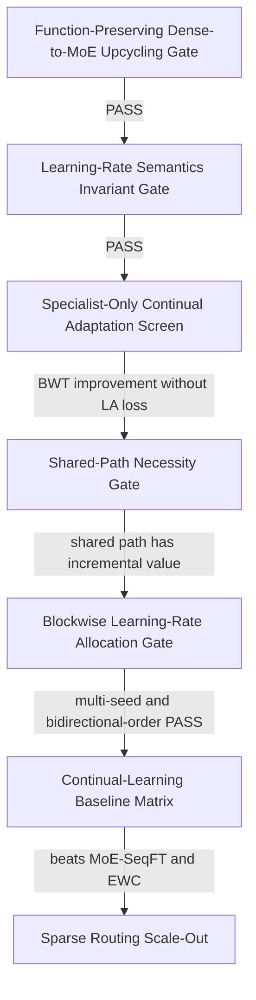

## 核心判断

此前“**小规模先全路由，扩大后再加入共享专家**”需要修正。

这里混淆了两个相互独立的维度：

1. **全路由还是稀疏路由**：决定每个样本激活多少 specialist experts；
2. **是否有 always-on shared expert**：决定是否保留一条承载通用知识的稳定路径。

更合理的路线不是：

> routed-only soft MoE → 扩大参数 → 再改成 shared+routed sparse MoE

而应是：

> **小规模即采用 shared residual + fully-routed specialists，先验证函数与优化语义；扩大后只把 specialists 从 soft routing 改成 top-k sparse routing。**

也就是说，共享专家不应等到 scaling 才突然加入，否则小规模得到的学习率、遗忘和路由结论很难迁移到大模型。

---

# 一、当前仓库实际采用的方案

当前主实验对象是：

- 低秩、全维 specialist experts；
- 所有专家参与计算的 soft routing；
- data/task-conditioned router；
- 没有 always-on shared expert；
- Sparse embedding、DNN 可以叫共享 backbone，但不能叫 shared expert。

当前前向确实是 routed-only：

```1076:1094:/root/Documents/Lfm4ads/model.py
class CrossExpertLayerLR(nn.Module):
    """低秩全维 MoE 交叉层：K 个 LowRankExpert + 可学习/可冻结 DataRouter。"""
    def __init__(self, dim=360, K=4, r=45, routing="data"):
        super().__init__()
        self.experts = nn.ModuleList([LowRankExpert(dim, r) for _ in range(K)])
        self.router = DataRouter(dim, K)

    def forward(self, x, x0, tab=None):
        gate = self.router(x)
        weighted = sum(gate[:, i:i + 1] * self.experts[i](x) for i in range(self.K))
        return weighted * x0 + x, gate
```

而 TCMR 只是在这个结构上增加 task-conditioned router，仍没有 shared expert。

仓库中虽然存在一个名为 shared expert 的旧 V2，但它是固定输出坐标分片：

```785:800:/root/Documents/Lfm4ads/model.py
dim_shared = dim // (K + 1)
dim_routed = dim // (K + 1)

self.shared = nn.Linear(dim, dim_shared)
self.experts = nn.ModuleList(
    [nn.Linear(dim, dim_routed) for _ in range(K)])
```

它最后通过拼接形成完整表示，不是现代 MoE 中“多个可互换全维专家输出求和”的标准语义。因此它不适合直接作为后续共享专家学习率研究主体。

优化器方面，现在 TCMR 仍是单一 AdamW：

```251:255:/root/Documents/Lfm4ads/train.py
criterion = torch.nn.BCEWithLogitsLoss()
optimizer = torch.optim.AdamW(
    _trainable(model), lr=lr, betas=(0.9, beta2),
)
```

所以当前状态应准确表述为：

> 已完成 routed-only soft MoE、静态任务条件路由和全局 LR 的前置探索；尚未完成现代 shared-and-routed MoE，也尚未真正实现 block/task-specific learning rates。

---

# 二、前沿调研对本项目真正有用的结论

按仓库现有调研，TokenMixer-Large、OneRec-V2、HD-Rec、DeepSeekMoE 等工作的共同点是：

- always-on shared expert；
- routed specialist experts；
- 浅层 dense、深层 MoE；
- 先稳定训练或 dense upcycling，再稀疏；
- 最终 sparse training + sparse serving；
- shared expert 主要承载通用知识和路由失误兜底；
- specialist experts 提供参数扩容和任务残差隔离。

但这些大规模工业结果不能直接推出 KuaiRand-1K 上“共享专家一定有效”。正确使用方式是：

- 把它作为**结构先验**；
- 在本仓库做小规模因果验证；
- 不能把工业模型的 expert 数、top-k 和稀疏率原样照搬。

特别是，shared expert 的价值不是“大模型参数多了才有”，而是：

1. 隔离跨任务共同知识；
2. 避免每个 routed expert 重复学习公共部分；
3. 为路由错误提供稳定残差；
4. 在持续学习中给 shared/common 与 specialist/residual 不同更新约束。

因此它反而应该在小规模机制验证阶段就出现。

---

# 三、推荐的小规模标准架构

建议把最终原型改成 **Shared-Residual Fully-Routed MoE**：

\[
m(h)
=
E_{\text{shared}}(h;\theta_h)
+
\alpha
\sum_{e=1}^{K}p_e(h,s;\phi_r)R_e(h;\theta_e),
\]

\[
h^+=h+x_0\odot m(h).
\]

其中：

- \(E_{\text{shared}}\)：由原 dense Cross 变换初始化；
- \(R_e\)：低秩、全维 residual specialists；
- 小规模阶段 \(p_e\) 是 softmax，全部专家参与；
- \(\alpha=0\) 或 specialist 的 up projection 零初始化；
- 初始时模型严格等价于原 dense checkpoint。

这个结构同时解决三个问题：

1. **小规模仍然是 fully routed**，方便验证梯度、路由和学习率；
2. **shared expert 从一开始就存在**，小规模和 scaling 后语义一致；
3. **dense-to-MoE 转换可做到函数保持**，避免转换瞬间掉点。

关键不变量应为：

\[
f_{\text{MoE}}(x;\alpha=0)=f_{\text{dense}}(x)
\]

并在固定 batch 上验证：

- logits 最大绝对误差；
- loss 差；
- pooled/per-task AUC 差；
- dense/shared 参数逐位复制；
- residual specialists 初始输出为零。

---

# 四、什么时候转成共享专家模式

## 不是由参数规模触发

不建议规定“达到多少参数以后才加 shared expert”。应采用证据关卡：

### `Shared-Path Necessity Gate`

比较至少三种结构：

1. `Dense Backbone`;
2. `Routed-Only Fully-Routed Specialists`;
3. `Always-On Shared Expert with Fully-Routed Residual Specialists`.

控制：

- 同 checkpoint；
- 同 seed；
- 同训练样本和步数；
- 同 head；
- 同 specialist 总容量；
- 分别报告 same-total 与 same-active 口径。

加入 shared path 的 PASS 条件应至少包括：

- 上游 AUC 不劣于 routed-only 的预注册 non-inferiority margin；
- 双向任务顺序下 BWT 配对改善；
- Learning Accuracy 不系统恶化；
- Fisher-weighted shared drift 下降；
- specialist 的跨任务负梯度冲突下降；
- shared 与 specialists 的反事实贡献不是完全冗余；
- 三 seed 方向一致，并超过预注册噪声地板。

当前最合理的结论是：

> 不应继续用 routed-only TCMR 直接 scaling；应先在小规模增加一个标准 shared residual 路径，并保留 routed-only 作为结构消融。

## 什么时候开始 sparse top-k

这是另一个关卡。只有在以下条件都通过后，才进入 soft → top-2 → top-1：

1. dense-to-MoE 转换函数保持；
2. soft MoE 上游不出现稳定退化；
3. soft MoE 在持续学习 BWT 上有明确价值；
4. router 解冻确实降低 specialist conflict，而不是只提高 task-expert MI；
5. shared/routed 更新语义和学习率不变量通过；
6. 实现真实 sparse dispatch，而不是计算全部 experts 后再把未选输出置零。

由于当前 Stage B 竞争性 FAIL、TCMR INCONCLUSIVE，所以现在还不到 sparse scale-out 阶段。

---

# 五、是否应冻结专家层之外的参数

## 应当做，但只能作为第一层因果实验

“只训练专家、冻结其他部分”是很好的机制隔离实验，可以回答：

> 在固定表示、固定路由下，specialist experts 的学习率和任务隔离本身能否改善持续学习？

建议采用渐进解冻，而不是从一开始全部训练。

### `Specialist-Only Continual Adaptation Screen`

训练：

- 当前任务 head/new task row；
- 当前任务拥有或新分配的 specialist experts。

冻结：

- Sparse embedding；
- DNN/backbone；
- shared expert；
- global data router；
- 旧任务 router/task embedding 行；
- 旧任务 head 行；
- 非当前任务拥有的专家。

这是最干净的 expert LR 实验。

### 后续逐块解冻

| 实验臂 | 可训练参数 | 回答的问题 |
|---|---|---|
| `Task-Head-Only Adaptation` | 新任务 head/embedding 行 | 不改变 backbone 的最低遗忘基线 |
| `Specialist-Only Adaptation` | head + 当前 specialists | 专家隔离本身是否有效 |
| `Specialist-and-New-Task-Router Adaptation` | 上述 + 新任务 router 行 | 路由是否提供增量价值 |
| `Slow-Shared Adaptation` | 上述 + shared expert 小 LR | shared 能否吸收跨任务共识 |
| `Full Four-Block Adaptation` | allocation/shared/router/specialist | 完整方法上限 |

因此：

- **可以冻结非专家部分来研究 expert learning rate；**
- 但不能只做这一臂，然后宣称已经解决 shared/router/task-specific LR；
- 最终方法必须与 head-only、expert-only、router-unfrozen、shared-unfrozen 对照。

此外，旧任务行不能仅靠“梯度为零”冻结。只要整个 embedding/head tensor 仍在 AdamW 参数组，weight decay 仍可能改动旧行。必须：

- 从活动参数组排除；
- 或按行拆参数；
- 或旧任务行所在组 `weight_decay=0`，并做逐位 immutability 检查。

---

# 六、现有文档能否支持“只研究专家”

## 能支持一个受限问题，但不能支持完整结论

现有 `docs/archive/analysis/20260812-1723-MoE-学习率分配审计与实验计划.md` 已经预注册：

- 先扫描 specialist LR；
- 此时 shared/router 冻结；
- 然后再扫描 shared-to-specialist ratio；
- 最后扫描 router-to-specialist ratio。

所以它足以支持：

> `Specialist-Only Continual Adaptation under Frozen Backbone and Router`

但目前有三个执行缺口。

### 缺口一：当前 TCMR 没有 shared expert

文档要扫描 \(\eta_h/\eta_e\)，但当前主模型没有 \(\theta_h\)。因此后续 shared LR screen 不能直接执行。

### 缺口二：当前仍是单一 AdamW

文档要求 post-preconditioner LR 和 exact task-state optimizer，代码尚未实现，不能把现有梯度乘因子当成学习率。

### 缺口三：缺少函数保持的 dense-to-MoE 转换关卡

现计划直接进入 continual LR screen，但如果 MoE 起点已经低于 dense，就会把架构损失、初始化损失和持续学习损失混在一起。

因此应该在当前 LR invariant gate 前后增加：

1. `Function-Preserving Dense-to-MoE Upcycling Gate`;
2. `Specialist-Only Continual Adaptation Screen`;
3. `Shared-Path Necessity Gate`;
4. 然后才是完整 `Blockwise Learning-Rate Allocation Gate`。

---

# 七、不同子任务学习率应如何分配

## 1. 现有指标还不够

当前文档已经规划了较好的**评价指标**：

- 标准 BWT；
- Learning Accuracy；
- worst-task forgetting；
- 新任务达到阈值所需 steps；
- Fisher-weighted drift；
- route churn；
- expert load；
- task-expert MI。

但尚未形成已经实现并验证的**在线 LR 分配器**。

需要明确区分：

### 在线分配信号

只能使用 train/replay/calibration 数据：

- post-preconditioner update norm；
- 新旧任务梯度 alignment；
- Fisher/importance；
- specialist ownership/load；
- route churn；
- update-to-weight ratio。

### 离线方法选择指标

可使用验证矩阵：

- BWT；
- LA；
- worst forgetting；
- pooled/macro AUC；
- learning speed；
- 计算和存储成本。

不能直接根据测试集 BWT 在线调 LR。

---

## 2. 建议的数学分配规则

对参数块 \(q\) 和新任务 \(t\)，令 Adam 预条件后的方向为：

\[
d_{q,t}=P_q^{-1}g_{q,t}.
\]

旧任务聚合梯度或 replay gradient 为 \(g_{q,\text{old}}\)，定义：

\[
c_{q,t}
=
\left\langle g_{q,\text{old}},d_{q,t}\right\rangle.
\]

再用旧任务 Fisher 估计沿当前更新方向的敏感度：

\[
v_{q,t}
=
d_{q,t}^{\top}F_{q,\text{old}}d_{q,t}.
\]

更新 \(\Delta\theta_q=-\eta_{q,t}d_{q,t}\) 对旧任务的局部影响近似为：

\[
\Delta L_{\text{old}}
\approx
-\eta_{q,t}c_{q,t}
+
\frac12\eta_{q,t}^2v_{q,t}.
\]

若该参数块允许的遗忘预算是 \(\varepsilon_q\)，则可得到安全上界：

\[
\eta_{q,t}^{\max}
=
\frac{
c_{q,t}+
\sqrt{c_{q,t}^2+2v_{q,t}\varepsilon_q}
}{
v_{q,t}+\epsilon
}.
\]

最终使用：

\[
\eta_{q,t}
=
\min
\left(
\eta_q^{\text{base}},
\eta_{q,t}^{\max},
\eta_{q,t}^{\text{UWR-cap}}
\right).
\]

其中 UWR cap 用于约束：

\[
\mathrm{UWR}_{q,t}
=
\frac{\|\Delta\theta_{q,t}\|_2}
{\|\theta_q\|_2+\epsilon}.
\]

这比“AU 高就促进/抑制”更合理，因为它同时考虑：

- 更新幅度；
- 新旧任务方向；
- 旧任务重要性；
- 实际 Adam 更新；
- 参数相对漂移。

---

## 3. 不同参数块的具体策略

### Shared expert/backbone

只吸收跨任务共识：

- \(c_{q,t}>0\)：允许小步更新；
- \(c_{q,t}<0\)：降低 LR、投影冲突分量或把残差写入 specialist；
- 高 Fisher 坐标自动减慢。

初始建议仍可采用：

\[
\eta_{\text{shared}}
=
0.05\sim0.1\,\eta_{\text{specialist}}.
\]

### 当前任务拥有的 specialist

以塑性为主：

\[
\eta_{\text{specialist}}
\in\{2\times10^{-4},5\times10^{-4},10^{-3}\}.
\]

新专家可用完整 anchor；旧任务复用专家根据 alignment/Fisher 限制在 \(0\sim0.5\eta_e\)。

不要按 \(1/q_e\) 机械放大低频专家 LR，否则低 load 专家的高方差会被进一步放大。

### Router

global data router 初始冻结：

\[
\eta_{\text{global-router}}=0.
\]

只有满足以下条件才解冻：

- routed experts 的负梯度冲突下降；
- route churn 没有恶化；
- BWT 改善；
- LA 不下降。

解冻后建议：

\[
\eta_{\text{router}}
=
0.02\sim0.1\,\eta_e.
\]

新任务 router embedding 行可稍快：

\[
\eta_{\text{new-task-router}}
=
0.1\sim0.25\,\eta_e,
\]

旧任务行严格冻结。

### Allocation gate

如果引入 shared/specialist allocation gate，则初始应固定或极慢：

\[
\eta_{\text{allocation}}
=
0\sim0.05\,\eta_e.
\]

否则单一新任务可能快速把全部流量推到 shared 或 routed 路径，导致路径塌缩。

---

# 八、如何看待上游改成 MoE 后预训练结果下降

## 当前证据不是“显著下降”，但已经足以说明方案不具竞争性

Stage B 中 low-rank full-dimensional soft MoE 相对 same-FLOPs dense 的同 seed 差为：

\[
[-0.0004,-0.0011,+0.0003].
\]

它跨 seed 变号，因此不能称稳定下降；但也不能称匹配或超过。再加上 wall-clock 更慢，所以竞争性主张 FAIL。

正确表述是：

> 当前 MoE 没有证明静态上游收益；观察到轻微均值下降和更高运行成本，但下降方向尚未达到多 seed 稳定性。

## 可能原因

### 1. 当前 same-FLOPs 低秩约束本身限制秩

每个 expert 的线性变换秩最多为 \(r\)，冻结均匀路由时：

\[
W_{\text{eff}}
=
\frac1K\sum_e B_eA_e,
\]

因此：

\[
\operatorname{rank}(W_{\text{eff}})
\le Kr.
\]

当前 \(r=d/(2K)\)，所以：

\[
Kr=d/2.
\]

也就是说，在冻结均匀路由下，有效线性映射最多半秩，而 dense Cross 层可以达到秩 \(d\)。它虽然同 FLOPs，但不是同函数容量，掉点并不意外。

### 2. 不是函数保持式转换

随机初始化的 low-rank MoE 不等于原 dense checkpoint，训练需要先重新恢复原函数，再学习专家分工。

### 3. 数据规模不足以喂饱多个专家

KuaiRand-1K 的数据规模远小于工业推荐模型。增加 experts 会减少每个 expert 的有效样本量，使 specialization 信号弱于优化噪声。

### 4. 当前路由信号本身较弱

TCMR 的 task-expert MI 约 `0.0018 nats`，且 DATR 相对锚点跨 seed 变号。提高 router LR 很可能只增加 route churn。

### 5. “同 FLOPs”不等于“同优化难度”

多个低秩分支、gate、专家对称性会增加条件数和优化不稳定性；即使理论 FLOPs 相同，也可能更慢、更难收敛。

---

# 九、应该怎么处理上游下降

## 第一优先级：改成函数保持式 upcycling

建议：

\[
E_{\text{shared}}
\leftarrow E_{\text{dense}},
\qquad
R_e(h)=0\ \text{at initialization},
\qquad
\alpha=0.
\]

然后：

1. 冻结 shared/dense trunk 和 router；
2. 先训练 residual specialists；
3. router 使用 frozen uniform；
4. specialists 开始产生非零且可区分的功能后，再小 LR 解冻新任务路由；
5. 最后才判断是否允许 shared 小步更新。

这样转换后的零步 AUC 不应下降。

## 第二优先级：加入表示保持约束

必要时加入：

\[
L=
L_{\text{CTR}}
+
\lambda_{\text{KD}}
\|f_{\text{MoE}}(x)-f_{\text{dense}}(x)\|_2^2
+
\lambda_F L_{\text{EWC}}.
\]

但 distillation 只能防止转换损失，不能代替持续学习 BWT 实验。

## 第三优先级：允许明确的稳定性—塑性折中

如果最终出现：

- 上游静态 AUC 小幅下降；
- 但多顺序、多 seed 的 BWT 显著改善；
- LA、新任务学习速度不下降；
- 最终平均/最差任务指标更好；

那么可以把论文结论写成：

> MoE sacrifices a small amount of static pretraining quality in exchange for improved continual-learning stability.

但必须预注册可接受的 non-inferiority margin，不能实验后再解释。

如果上游下降、BWT 也没有稳定改善，就应停止 MoE 持续学习主张，而不是继续扩大参数寻找偶然结果。

---

# 十、建议的文档驱动实验顺序



## 1. `Function-Preserving Dense-to-MoE Upcycling Gate`

- dense checkpoint → shared residual MoE；
- 零步 logits/loss/AUC 等价；
- residual specialists 零输出；
- router frozen uniform；
- 不通过不得训练。

## 2. `Learning-Rate Semantics Invariant Gate`

- 验证 pre-Adam 梯度缩放抵消与 parameter-group post-preconditioner LR；
- 验证旧任务 head 行和非拥有专家逐位不变；
- 验证 sample-weighted gradient conservation；
- 验证标准 BWT 使用 `A[T-1,j]-A[j,j]`；
- 任一失败均阻塞后续 GPU 矩阵。

## 3. `Specialist-Only Continual Adaptation Screen`

- `scenario-0 then scenario-3` 及反向；
- seeds 42/123/456；
- 只训练 head/new-task row + specialists；
- 扫描 \(\eta_e=\{2e-4,5e-4,1e-3\}\)；
- shared/backbone/router 冻结。

## 4. `Shared-Path Necessity Gate`

比较：

- routed-only；
- shared frozen；
- shared \(0.05\eta_e\)；
- shared \(0.1\eta_e\)；
- shared + Fisher/EWC。

## 5. `Blockwise Learning-Rate Allocation Gate`

比较：

- uniform AdamW；
- pre-Adam gradient scaling；
- post-preconditioner four-block LR；
- exact task-state optimizer；
- Fisher/alignment constrained LR。

## 6. `Continual-Learning Baseline Matrix`

至少：

- Dense SeqFT；
- EWC；
- Reservoir Replay；
- Frozen Backbone + Adapter；
- MoE SeqFT；
- Specialist-Only；
- Four-Block LR；
- Exact Task-State；
- 完整 alignment-aware 方法。

## 7. `Sparse Routing Scale-Out`

前述全部 PASS 后才进行：

- soft；
- top-2；
- top-1；
- same-active；
- same-total；
- same-latency；
- 真实 sparse dispatch。

---

## 最终建议

1. **小规模继续使用 fully routed specialists，但现在就加入 always-on shared residual path。**
2. routed-only 保留为消融，不再作为最终 scaling 原型。
3. 第一轮持续学习应冻结非专家 backbone/router，只训练新任务 head 和 specialists，以隔离 expert LR 的因果作用。
4. 现有文档足以支持这个受限问题，但不足以直接执行 shared LR；需要先补架构定义和函数保持关卡。
5. LR 分配应基于 post-Adam update、gradient alignment、Fisher drift 和遗忘预算，而不是 AU 大小或 task-expert MI。
6. 上游 MoE 当前不是“显著下降”，但已表现为无竞争性；优先做 function-preserving upcycling，不应直接扩大或稀疏化。
7. 只有 soft shared-and-routed MoE 在 BWT/LA 上稳定通过，才进入 top-k scaling。

如果这个方案符合研究目标，下一步应更新总驱动文档并把 `Function-Preserving Dense-to-MoE Upcycling Gate` 冻结为新的前置关卡；需要实际修改文档和代码时，请切换到 CRAFT 模式。